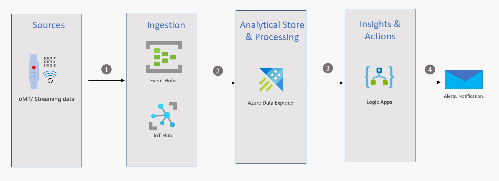

# Remote Patient Monitoring using Azure Data Explorer (ADX) and Logic Apps
## Introduction
Modern healthcare providers are innovating at a faster pace and Covid19 just accelerated that. Continuous or Remote patient monitoring is one such area which is leveraging modern technology to serve patients in a better way. I will be showcasing how we can leverage Azure Cloud Services to remotely monitor patients and notify the care practitioner for prompt action. While there are absolutely numerous ways to achieve our goal, I considered using Azure Data Explorers for the reasons mentioned below.
Why Azure Data Explorer
Azure Data explorer is a perfect fit for many of today’s use cases that involves variety of data such as clickstreams, Sensors, RFID, IoT Streams, Social Sentiment data like Tweets, comments, logs, Spatial data like GPS location, financial data like market feeds, Weather, eGov feeds and many more. Azure Data explorer also supports different velocity of data be it Streaming or batch at petabyte scale.
For our use case where we are remotely monitoring patient vitals, Azure Data Explorer is ideal for analyzing large volumes of data from IoMT devices. Azure Data Explorer makes it simple to diagnose, monitor, report and do complex ad hoc queries on the data in seconds.

## Solution Architecture

## Data Flow
1.	Patient Vitals like Heartbeat, Spo2, Body Temperature, Systolic and Diastolic pressure are collected and streamed using Medical Devices/IoMT. 
2.	 The Streaming Data is collected either using IoT Hub or EventHub and then fed into Azure Data Explorer in Near Real Time
3.	Azure Data Explorer (ADX) serves as Analytical store and ETL processing. ETL is done using ‘Update policy’ feature of ADX. 
4.	Logic Apps serves as automated workflow engine. It runs on a set schedule and sends email notifications to concerned stakeholders using Office 365 whenever patients vitals are critical.
